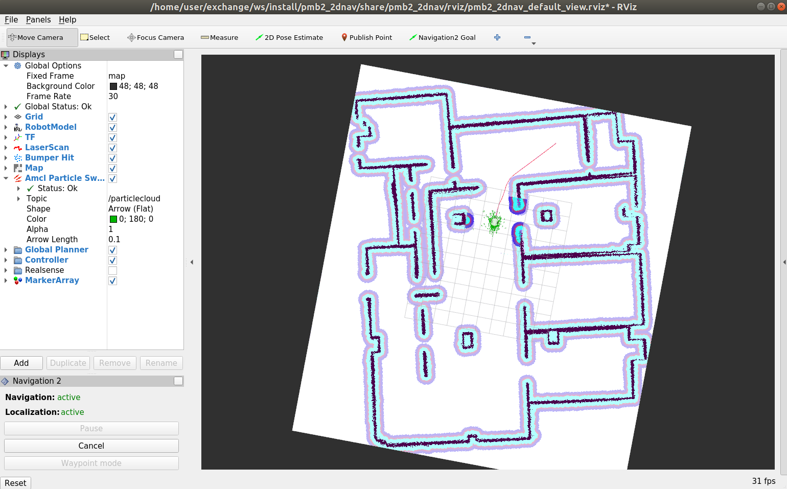

.. _navigation:

******************************
PMB-2 Navigation tutorial ROS2
******************************

Purpose
#######

This tutorial shows how to make PMB-2 navigate autonomously provided a map build up of laser scans and taking into account the laser and the RGBD camera in order to avoid obstacles.

Pre-Requisites
##############

First make sure that the tutorials are properly installed along with the PMB-2 simulation, as shown in the tutorials `installation`_ section. Then follow the instructions in the `PMB2_mapping`_ tutorial in order to create and save a map.

Execution
#########

First of all open two consoles and source ros setup

.. code:: bash

   source /opt/ros/foxy/setup.bash

In the first console launch the following simulation

.. code:: bash

   ros2 launch pmb2_2dnav_gazebo pmb2_navigation_gazebo.launch.py

This will launch a gazebo window and a rviz window with a map.
Select on the rviz window the ``2D Pose Estimate`` mode and set the approximate robot position on the map.

.. image:: media/pose_estimate.png
    :alt: rviz pose

.. image:: media/gazebo_nav.png
    :alt: gazebo

In the second console launch the keyboard teleoperation node

.. code:: bash

   ros2 run teleop_twist_keyboard teleop_twist_keyboard --ros-args --remap cmd_vel:=key_vel

.. image:: media/key_teleop.png
    :alt: teleop ros2

Now you can navigate the robot to correct the position error.

To send a navigation goal you can use the rviz ``Navigation2 Goal`` mode and select the desired goal.

.. image:: media/goal.png
    :alt: gazebo goal

After selecting the goal you can see the global path planned and the local path.

.. _installation: http://wiki.ros.org/Robots/PMB-2/Tutorials#Tutorials_Installation
.. _PMB2_mapping: https://cesc-folch.github.io/pmb2-tutorial/mapping
